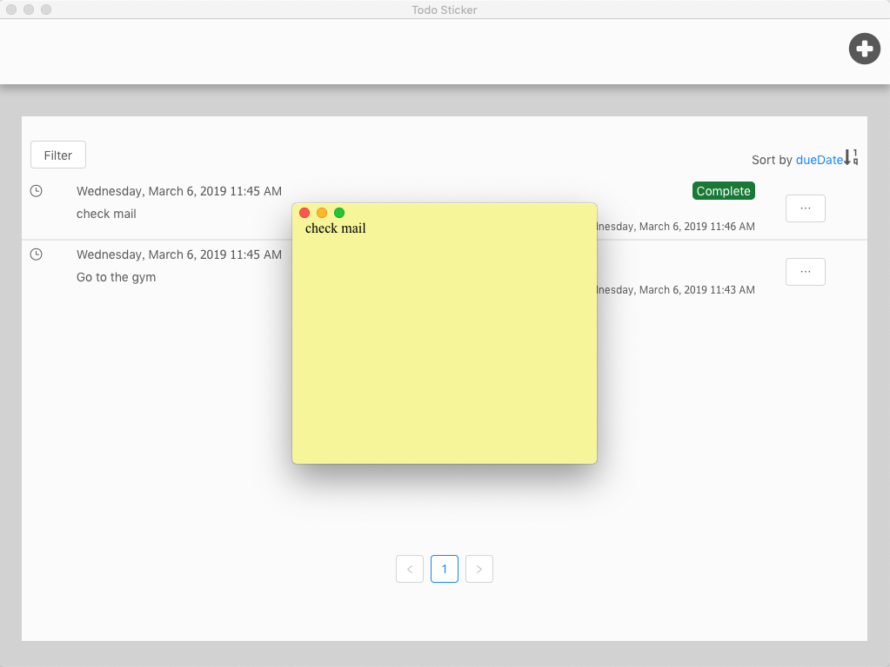

# [Todo Sticker](https://todosticker.gavinwang.net/)

Easy-to-use To-Do App, which can create sticky notes with time-reminder function.



## Features
*   Create the sticky note of to-do.
*   Time-reminder.
*   Filter and sort to-do list.

## Development

*   Clone the repo

```sh
    git clone https://github.com/ambisign-gavin/todo-sticker.git
    cd todo-sticker
    npm install
```

*   Start webpack-dev-server

```sh
    npm run dev:server
```

*   Start electron app

```sh
    npm run dev:electron
```

## License

MIT
